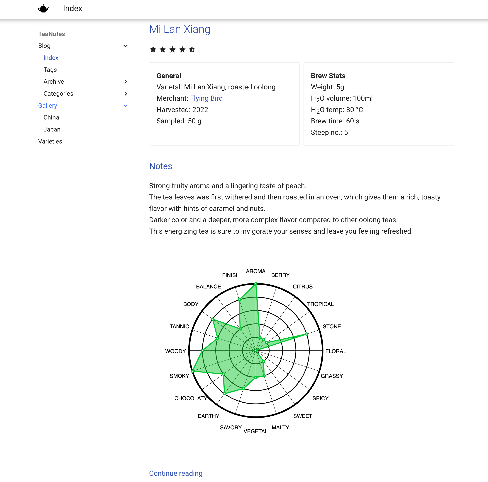

<!-- toc -->

# [TeaNotes.blog](http://teanotes.blog/blog/)
My digital tea notes.  



## Development
 
### requirements
* Python 3.11
* pip3
```
pip3 install -r requirements.txt
```
### build
```sh
python3 -m mkdocs build
```
or serve for development
```sh
python3 -m mkdocs serve
```

## Tools used

### [mkdocs for materials](https://squidfunk.github.io/mkdocs-material/)

### [DanGe42/flavor-wheel](https://github.com/DanGe42/flavor-wheel)